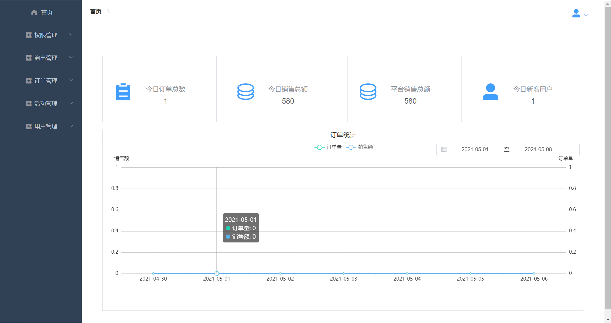
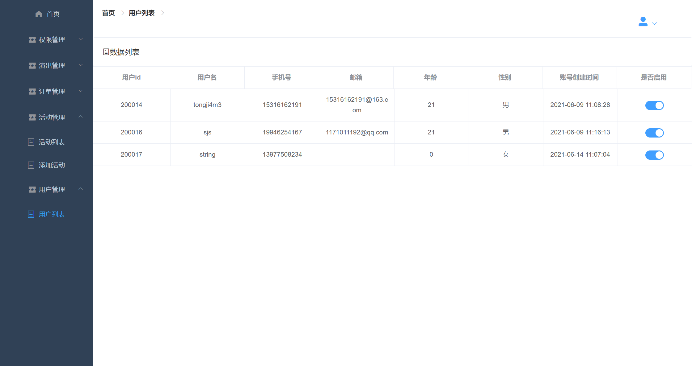

# 客户端操作说明

客户端分为7大板块，分别为：

1.  用户账号模块：包括注册、登录、修改个人信息

2.  演出模块：包括搜索、查看演出详情、购票

3.  订单模块：包括查看订单、取消订单、删除订单

特别说明：

1.  所有操作都要在登录之后才能完成，若未登录而进入首页，只能观看首页内容，不能进行搜索、查看详情、购票、查看订单等操作。

2.  未注册用户无法登录，必须使用从未注册过的手机号和用户名进行注册

3.  点击每个页面的右上角都可以返回首页

## 用户模块

### 注册

注册步骤：

1.  填写用户名

2.  填写密码，注意密码不能过于简单

3.  填写手机号码并获取验证码

4.  将手机收到的验证码输入

5.  上传个人头像

6.  注册

注册常见问题

1.  用户名或手机号被占用：系统将给出提示，请用户修改自己的用户名或手机号

### 登录

为了方便广大用户，本系统设置了3种登录方式，分别为：

1.  账户-密码登录：用户使用注册时的用户名及密码登录

2.  手机号-密码登录：用户使用注册时的手机号及密码登录

3.  手机号-验证码登录：用户使用注册时的手机，系统向其发送动态验证码，用户提交验证码登录

#### 账户密码登录

### 修改个人信息

在“首页-\>我的信息”中可以进入个人信息页面。

直接点击输入框可以修改信息，点击“更新”即可保存个人信息。

#### 手机号密码登录

#### 手机号-验证码登录

## 演出模块

### 搜索页面

用户登录后即可进入首页查看最近出演信息。从首页点击任一分类名称即可跳转到搜索页面。

本系统提供多种搜索与筛选方式：

1.  关键词搜索

2.  按城市

3.  按分类

4.  按时间

此外，搜索结果还可以按时间、价格等排序。

### 查看演出详情

点击图片即可查看演出详情，包括：

1.  演出名称

2.  演出海报

3.  演出地点

4.  演出时间

5.  票种

6.  票价

7.  剩余票数

8.  观影须知

### 购票

步骤：

1.  选择票种

2.  选择票数（最少1张，最多3张），可以使用“+”与“-”选择，也可以直接输入数字（注意：超出范围的数字会被自动校正）

3.  预览最终价格

4.  点击购票

5.  选择支付方式

6.  第三方支付后选择确认

7.  页面提示购票成功或失败

### 活动票价

活动票在前方会有特殊标志指明其为特殊活动票价。

活动票价采取**限购措施**，同一账号只能购买一次，并且每次不超过一张。

购买后购票按钮变灰，无法再次点击。

## 查看订单

在“首页-\>头像-\>我的订单”中可以进入订单页面。

订单页面提供一下几种操作：

1.  查看有订单

2.  查看待看订单

3.  查看已完成订单

4.  查看已退订单

5.  取消订单

### 查看订单详情

### 取消订单

取消订单有两个入口：

1.  查看所有订单-\>取消订单

2.  查看订单详情-\>取消订单

此时回到订单页面，可以看到订单已经是取消状态

### 删除订单

**已取消**或**已完成**的订单可以从列表中删除。

# 服务端操作说明

服务端是管理员进行数据与业务管理的页面，主要分为5大版块：

1.  权限管理

2.  演出管理

3.  订单管理

4.  活动管理

5.  用户管理

特殊说明：

1.  必须登录才能进入管理员页面，否则将被重定向到登录页

2.  不同的账号权限不同，看到的页面也不同

登录页面

管理员首页：从首页中可以看到一些统计图标和信息。

## 权限管理

系统严格限制管理权限，不同的管理员账号登录会看到不同的界面并拥有不同的管理权限。这样做，可以使得不同的管理员只能看到或操作其负责的演出信息或者订单信息，避免了权限过多、操作错误导致的损失。

### 权限列表

添加、编辑、删除、启用/禁用相关管理权限的资源与数据，包括后台用户管理、后台菜单管理等，只有超级管理员才能有此权限。

### 菜单列表

对于管理员页面的菜单栏的管理，可以增添、编辑、或删除菜单栏的功能。

菜单栏是分级的，可以在各级菜单栏中查看某一菜单的下级菜单栏。

一级菜单：

二级菜单：

### 账号列表

对于管理员账号的管理，可以添加、修改或删除管理员账号。

另外，还可以通过给账号分配角色，赋予其不同的管理权限与视图。

### 角色列表

角色概念对应于数据库中的角色管理概念，通过对不同角色的权限管理（如增删改查权限、视图等），并将角色赋给不同的账号，实现对管理员系统账号的复杂的业务逻辑的实现以及更为简单高效的管理。

### 资源目录

管理资源目录

## 演出管理

用来管理演出的信息与相关资源。

### 添加演出

### 目录管理

管理客户端首页的导航栏的设置，包括导航栏栏目的图标、名称、目录权限等。

管理员可以编辑、启用或禁用该栏目。

### 演出列表

管理演出信息，可以编辑、查看或删除已有的演出和活动。

## 订单管理

### 订单列表

显示用户对于演出的订单，管理员可以查看或删除该订单（在法律范围允许的情况下）。

### 订单历史

因为订单是与业务生死攸关的模块，所以关于订单的处理必须是最谨慎的，每一条操作都需要记住，因此有了订单历史模块。

用户、管理员关于订单的所有操作都将在此处记录和展现。

## 活动管理

管理各种优惠促销活动，活动中票价会有降价或补贴。

### 活动列表

### 添加活动

打开活动页面，点击“座次”，点击“添加活动”，填写活动促销内容，点击“添加”

## 用户管理

用来管理用户账户，防止受到恶意攻击等。

管理员禁用某一账号后（即选择“不启用”），该账号仍会留存在数据库中，但该账号无法再被登录。

